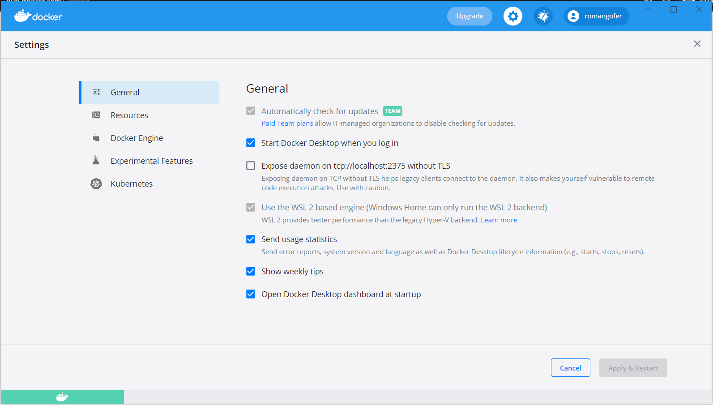
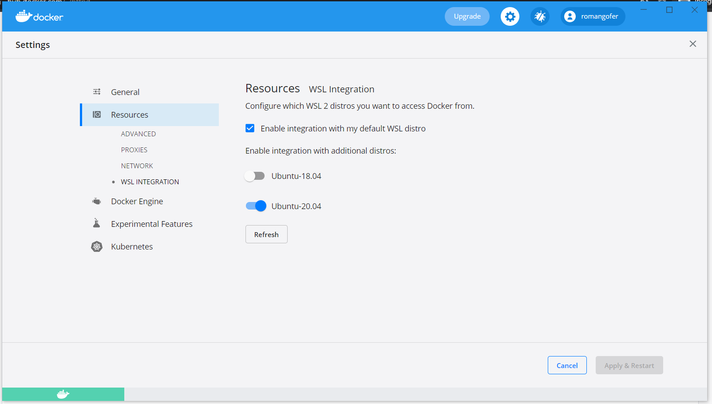

# Project 5 Documentation

## Part 1 - Dockerize It

- Project Overview:
    - This project is going to be a website-hosting server that will host webpage content using the Apache webserver service. The server/method of hosting this content will be a Docker container. This way, this project can be wrapped up in a compact container that can easily be downloaded/installed on different systems and toted around without having to worry about installing and setting up all the project's dependencies on the system itself. This makes it easier because the container with the project in it can be run by someone without the person having to bog down their own system with the dependencies just to run the project and see how it works.
- Run Project Locally:
    - How I installed Docker + dependencies: To begin, I installed Docker desktop on my Windows system. I already have another dependency, WSL2, installed on my system, so I didn't have to install anything special for this part of the project. Once Docker desktop was installed, I went into Docker desktop and make sure that some settings were configured correctly. These are as follows:
        1. I made sure the "Use the WSL 2 based engine" box was checked under "General" > "Settings" in Docker desktop.
        2. Under "Settings" > "Resources" > "WSL Integration", I made sure that the "Enable integration with my default WSL distro" box was checked.
        3. On the same section as the previous setting, I also made sure that under "Enable integration with additional distros:" the "Ubuntu-20.04" switch was toggled on since this is the distro that I currently use.
    - Once all these settings were configured correctly, I pressed the "Apply & Restart" button on Docker desktop to apply the new settings and restart Docker.
    - Here is a screenshot of how the first described screen should look:
    
    - Here is a screenshot of how the second described screen should look:
    
    - My "Apply & Restart" button was not lit up and clickable because I didn't change any settings when I took the screenshots since I had already configured them.
    - Also, the WSL 2 based engine setting was enabled by default for me, and I can't change mine because my system supports WSL 2, so this might not be greyed out as a default setting, and the box might need to be checked manually.
- How to build the container:
    - To find the container that was the right one to use for this project, I went to DockerHub and searched "apache" in the search bar at the top.
    - The first option to come up was the official Apache image, which is called "httpd", which is the one I am using for this project.
    - To pull the container to my system, I ran `docker pull httpd`.
    - Once the image was pulled, I created a `Dockerfile` inside my project git repository and added the following lines to the file:

                                             ```
                                             FROM httpd:2.4
                                             COPY ./public-html/ /usr/local/apache2/htdocs/

                                             ```
    - After this, I created a `public-html` directory inside my repository to store my HTML content.
    - Also, to get the `Dockerfile` to work properly and build successfully, I put the `Dockerfile` inside of the parent directory of `public-html`, which was just the main space in my project repository.
    - Another step I took was copying my HTML/CSS content into the `public-html` folder.
    - Once this was finished, I ran `docker build -t my-apache2 .` while I was in the main directory of my project repository, which was the parent directory of the `public-html` folder. When this command was run, the HTML file from the `public-html` directory was copied onto the new container being built since this was specified inside the `Dockerfile`. This could be copied from another directory, it would just have to be specified inside the `Dockerfile`.
    - After the container was built, I ran `docker run -dit --name my-running-app -p 8080:80 my-apache2` to run the container and bind it to port 8080 on localhost.
    - Once the container was running, I was able to view the project webpage in a browser by going to http://localhost:8080/. Since the IP address for localhost is "127.0.0.1", http://127.0.0.1:8080 could also be typed in on my computer to access the webpage since localhost refers to "127.0.0.1". Also, the ":8080" at the end of the URL that is being typed in is to specify to the browser to look on port 8080 for the content since that is what port the website was bound to when the container was run.

    ## Part 2 - GitHub Actions and DockerHub

    - Create DockerHub public repo: 
        - Process to create: I went to the [DockerHub website](https://hub.docker.com/) and created a free account.
        - Then, I clicked on "Repositories" > "Create Repository". 
        - After this, I typed in the name I wanted to give my repo, which was "ceg3120-mysite". 
        - Also, I needed to choose the visibility of the repo, and I could choose from a public or private repo. Private repos cost money, and     DockerHub only allows one free private repo, so I made mine public.
        - I clicked the "Create" button once I specified all of these settings.
    - Allow DockerHub authentication via CLI using Dockhub credentials:
        - To login to push to DockerHub, the `docker login` command needs to be used. There are different ways to use this command. The way that I used this is I ran `docker login -u MYUSERNAME`. In this command, the `-u` flag means the DockerHub account username for the desired account to sign into is being specified. When I ran this, it asked for my DockerHub password, which I typed in and then hit "Enter".
        - After a few seconds, the screen said "Login Succeeded" and explains how logging in with the password grants the terminal complete access to my account. Also, it recommends logging in with a personal access token for better security.
        - Another option to login with Docker is to provide both the username and password in the same line. For example, `docker login -u USERNAME -p PASSWORD` can be run instead of entering the password separately. This is insecure, but it could be done. However, the better option to login with one line is to login using standard input. To do this, the following command could be run: `cat dockerhub-password.txt | docker login --username USERNAME --password-stdin`. This pipes the output of doing `cat` on a file with the DockerHub password stored in it to the docker login command and tells the system to use this for the password.
    - Configure GitHub Secrets:
        - To store DockerHub credentials as Secrets on GitHub, the username and password for DockerHub will be needed.
        - To set these credentials as Secrets and give them a name to refer to, the user will need to go online and sign into their GitHub account.
        - Once this is done, the user will need to click on the repository they want to set secrets for.
        - After this, they will need to click "Settings", scroll down to "Security" on the left side of the webpage, click on "Secrets" in the "Security" section, and then click on "Actions".
        - On the screen where it says "Actions secrets", click "New repository secret"
        - After clicking this, the GitHub website will display a screen where a secret can be given a name to refer to.
        - The username and password will need to be added as separate secrets, I named mine for the username "DOCKER_USERNAME" and "DOCKER_TOKEN" for my password secret. This security token can be generated and used instead of password authentication, which I chose to setup.
        - In the "Value" box, insert the DockerHub username for the username secret, and either the security token or the password for the password secret into the box.
        - Once this is finished, click the green "Add secret" box.
        - After this, the Secrets can be viewed on the "Actions secrets" page, where information such as how long ago the secrets were created will be displayed.
        - To refer to this secret in a workflow file, just put "${{ secrets.SECRET_NAME }}" instead of the username or password itself.
    - Configure GitHub Workflow:
        - Variables to change: there are a number of important variables to change in a workflow file, such as which DockerHub repo should be connected to, and the version tags for the image being built and pushed.

## Part 3 - Deployment

- Container restart script:
    - What it does: My container restart script, `pull-restart.sh`, first pulls the latest version of the docker image pushed to my Dockerhub repo.
    - Then, it "prunes" all unused images without prompting for confirmation. This comes into play when an old image is being run, and a new, updated one wants to be run. In other words, it "clears the way" for the host port, 80 in this case, to host the updated image.
    - After pruning, my script pulls the new latest image from my Dockerhub repository.
    - Once the image is pulled, the script now runs the new image and binds it to port 80.
- Webhook task definition file
    - What it does: This file, `redeploy.json` is what I named mine, is a file that specifies what the webhook will do when it is run.
    - Also, this file specifies what the id of the webhook will be, and this is where the script that will be run when the webhook is triggered is specified. I put in the absolute path to my script for this.
    - In this file there is also a "trigger-rule" section where the rules for the webhook to be triggered are specified.
    - For this, I put in `"type": "payload-hash-sha1"` in the `"match"` section, meaning that the hash is what needs to match for the webhook to be triggered.
    - Git uses sha-1 to generate hash signatures with each payload created, so setting a sha-1 hash as what is needed to trigger the webhook is necessary.
    - Since this sha-1 hash is generated by GitHub, the secret can be used to verify that the hashes match.
    - There was also the option to specify a `"secret"`, which is a way of authenticating with a GitHub webhook since a secret phrase can be set when creating a GitHub webhook.
    - The "parameter" section specifies that this hash should be in the header of each payload request as `X-Hub-Signature`.
    - This is what the file ended up looking like:
    -[screenshot of redeploy](redeploy.PNG)

- Setting up a webhook on the server:
    - How I created my own listener: To do this I installed `webhook` on a Ubuntu 20.04 instance by running `sudo apt install webhook`.
    - For good measure, I also ran sudo apt update and sudo apt upgrade.
    - It is important that Ubuntu 20.04 be used for this part because there were version issues with webhook installing on Ubuntu 18.04 for me.
    - I tried installing a webhook using go, but it could not find the right library.
    - After the right software was installed, it was time to get my webhook started.
    - To do this, I ran `sudo webhook -hooks redeploy.json --verbose` inside my repo directory with my redeploy file.
    - Running with sudo is important if not a part of the docker group, or else the hook will not work properly.
    - Port 9000 had to be opened up in my security groups as well.

- Setting up a notifier in GitHub or DockerHub:
    - I tried both sites for this
    - I created a webhook on GitHub and Dockerhub and typed in the URL for my server in both spots.
    - The URL was http://3.234.135.166:9000/hooks/redeploy
    - Port 9000 needed to be specified in the URL
    - After I committed and pushed with a tag, my workflow ran, and the hook picked up the push.
    - After this, the hook ran the new Docker image, and I could go to my server's public IP address and look at my newly-updated website content